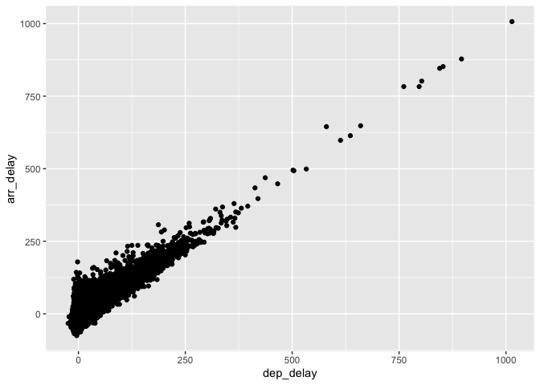

HW 4
================

``` r
# 1) Sum using variables
a <- 3
b <- 2
print(a + b)
```

    ## [1] 5

``` r
# 2) Sum of two numbers
sum(1, 2)
```

    ## [1] 3

``` r
# 3) Scatter plot of AA flight delays, departure delay vs arrival delay
library(tidyverse)
library(nycflights13)
AA_flights <- filter(flights, carrier == "AA")
ggplot(data = AA_flights) +
  geom_point(mapping = aes(x = dep_delay , y = arr_delay))
```

<!-- -->
