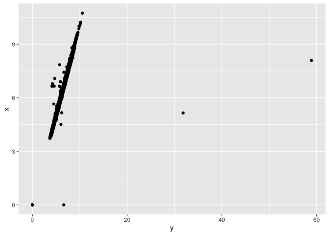
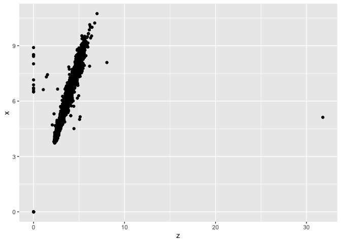
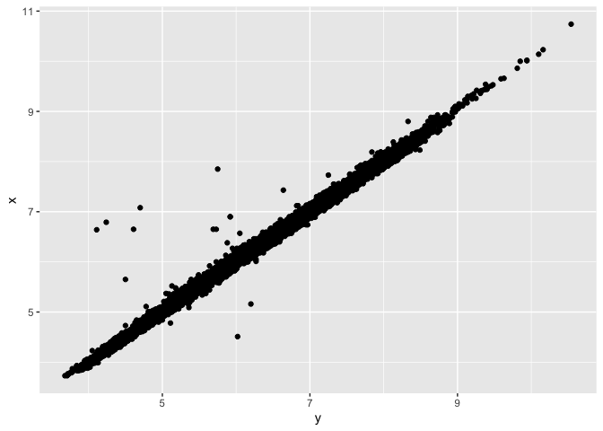
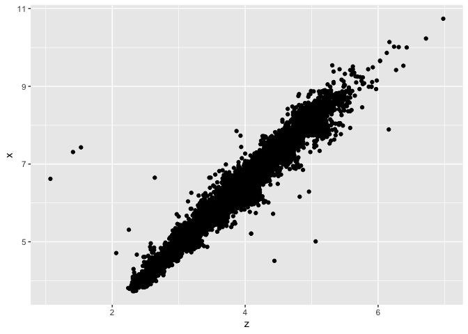

HW 5
================

``` r
library(tidyverse)

# Count the diamonds in each cut
count(diamonds, cut)
```

    ## # A tibble: 5 × 2
    ##   cut           n
    ##   <ord>     <int>
    ## 1 Fair       1610
    ## 2 Good       4906
    ## 3 Very Good 12082
    ## 4 Premium   13791
    ## 5 Ideal     21551

``` r
# Randomly select 1% of the diamond data
reduced_diamonds <- sample_frac(diamonds, .01)
reduced_diamonds
```

    ## # A tibble: 539 × 10
    ##    carat cut       color clarity depth table price     x     y     z
    ##    <dbl> <ord>     <ord> <ord>   <dbl> <dbl> <int> <dbl> <dbl> <dbl>
    ##  1  1.51 Very Good H     SI2      60.2  59    8444  7.33  7.43  4.44
    ##  2  1    Premium   F     SI2      62.4  56    3977  6.35  6.31  3.95
    ##  3  0.5  Ideal     G     VVS2     62.9  57    1935  5.11  5.04  3.19
    ##  4  0.26 Ideal     G     VVS2     62.7  53     514  4.09  4.11  2.57
    ##  5  0.9  Ideal     D     VS2      61.5  56    4128  6.25  6.2   3.83
    ##  6  0.37 Premium   E     VS2      59.5  59    1041  4.71  4.64  2.78
    ##  7  0.34 Ideal     E     SI1      62.9  56     765  4.48  4.45  2.81
    ##  8  0.34 Ideal     G     VVS2     61.6  56     775  4.47  4.49  2.76
    ##  9  0.3  Very Good I     VS1      63    53     473  4.26  4.31  2.7 
    ## 10  0.55 Ideal     G     VS2      61.2  56.8  1604  5.28  5.31  3.24
    ## # … with 529 more rows

``` r
# Find average size of top 100 diamonds of each clarity category
diamonds %>%
  group_by(clarity) %>%
  slice_max(order_by = carat, n = 100, with_ties = FALSE) %>%
  summarize(average.carat = mean(carat))
```

    ## # A tibble: 8 × 2
    ##   clarity average.carat
    ##   <ord>           <dbl>
    ## 1 I1               2.51
    ## 2 SI2              2.62
    ## 3 SI1              2.30
    ## 4 VS2              2.23
    ## 5 VS1              2.10
    ## 6 VVS2             1.66
    ## 7 VVS1             1.51
    ## 8 IF               1.40

``` r
# plot x vs y, x vs z
ggplot(diamonds) +
  geom_point(aes(y = x, x = y))
```

<!-- -->

``` r
ggplot(diamonds) +
  geom_point(aes(y = x, x = z))
```

<!-- -->

``` r
# Remove outliers
rm_outliers <- diamonds %>%
  filter(x > 0, y > 0 , z > 0) %>%
  filter( y/x < 4, z/x < 4)
  
ggplot(rm_outliers) +
  geom_point(aes(y = x, x = y))
```

<!-- -->

``` r
ggplot(rm_outliers) +
  geom_point(aes(y = x, x = z))
```

<!-- -->
