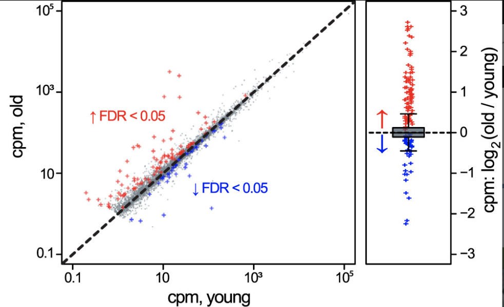
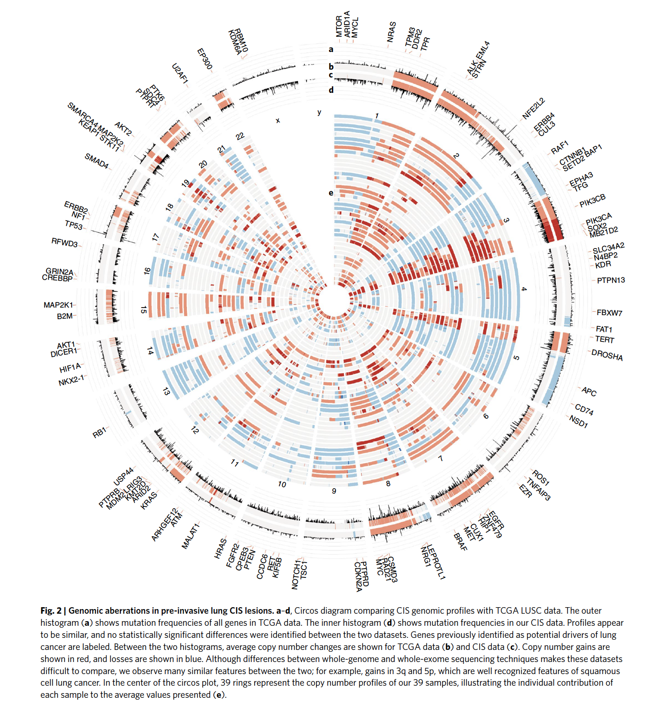

HW 5
================

## Example of a good plot

-   Scatterplot
    -   cpm from young mice mapped to x axis
    -   cpm from old mice mapped to y axis
    -   color mapped to values with FDR &lt; 0.05 (red is higher
        expression in old, blue is higher expression in young)
-   Boxplot
    -   Log fold change of genes with FDR &lt; 0.05 mapped to y axis
    -   color is mapped to genes with positive or negative fold change
    -   error bars show upper and lower quartile of fold change for
        genes

I like this plot because it uses multiple plots to characterize the
data. I really liked how they plotted all the data points in the
scatterplot but mapped color to values with a FDR &lt; 0.05

## Example of a Bad/ugly Plot

-   Outer labels mark location of potential drivers of lung cancer
    -   chromosome position is mapped to the radius location
-   The data named “mutation frequency - TCGA” is mapped as the outer
    histogram
    -   number of mutations is mapped to the y-axis
    -   chromosome position is mapped to the radius location
    -   plotted as a histogram
-   The data named “average copy changes - TCGA” is mapped below the
    TCGA histogram
    -   color is mapped to copy number
    -   chromosome position is mapped to the radius location
    -   plotted as a heatmap
-   The data named “average copy changes - CIS” is mapped below the
    average copy change heatmap
    -   color is mapped to copy number
    -   chromosome position is mapped to the radius location
    -   plotted as a heatmap
-   The data named “mutation frequency - CIS” is mapped as the inner
    histogram
    -   number of mutations is mapped to the y-axis
    -   chromosome position is mapped to the radius location
    -   plotted as a histogram
-   The copy number data for each individual in the study is mapped in
    the inner section of the circos diagram
    -   color is mapped to copy number (gain is red, loss is blue)
    -   chromosome position is mapped to the radius location
    -   Row is mapped to patient number
    -   plotted as a heatmap

I think this is a bad plot because too much information was put into a
small area making it hard to interpret the data. The histograms are so
small it is hard to tell where the greatest variations are. For the
individual patient data, since the circle gets really small in the
middle you can’t tell what the data looks like for those patients.

As well, it is wrong because there is no scale for the histogram or heat
maps.

I think this graph is a better data summary piece to be added in the
supplemental figures. I would prefer a few representative pieces to be
shown here in a linear format instead of the ciros plot.
