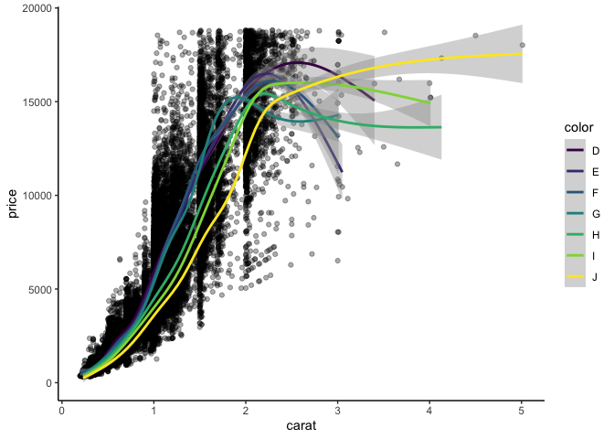
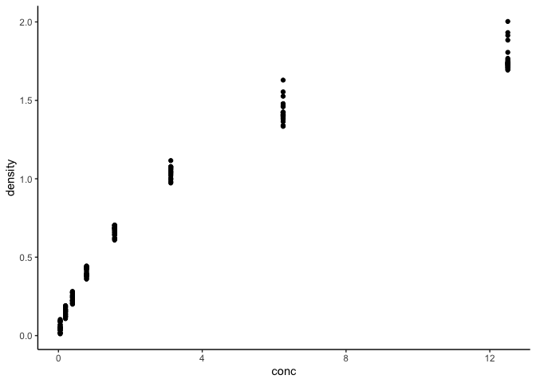
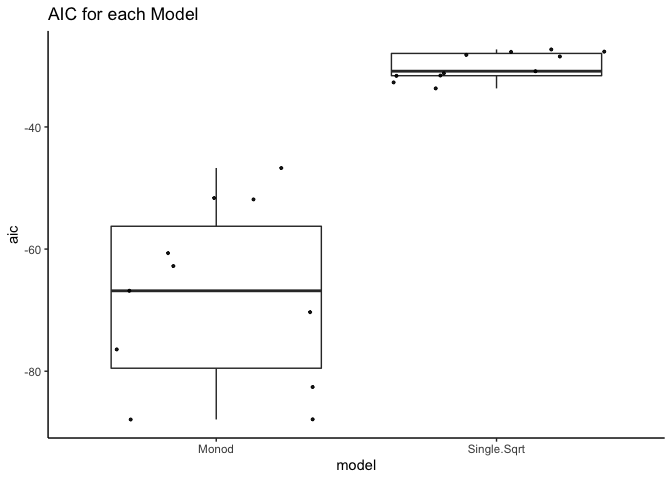
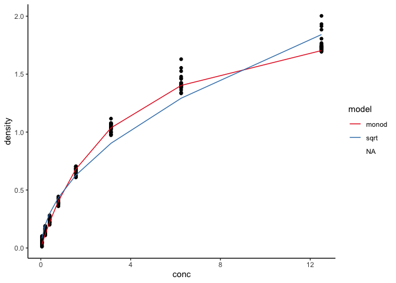

HW8
================

``` r
library(tidyverse)
library(nls2)
library(modelr)
library(broom)
library(viridis)
```

\#Question 1

``` r
theme_set(theme_classic())

ggplot(diamonds, aes(carat, price, group=color))+
  geom_line(alpha=.33)
```

<!-- -->

\#\#Formula

``` r
price_by_weight_color <- lm(formula = price ~ carat + color, data=diamonds)
```

\#\#Data Wrangling

``` r
by_color <- diamonds %>%
  group_by(color) %>%
  nest()

price_by_weight_fit <- function(df) {
  m <- lm(price ~ carat, data=df)
  m
}

by_color <- by_color %>%
  mutate(fit = map(data, price_by_weight_fit))

get_slope <- function(fit_obj){
  slope <- coef(fit_obj)[2]
  slope
}

by_color <- by_color %>%
  mutate(slope.priceByWeight=map_dbl(fit, get_slope)) %>%
  arrange(slope.priceByWeight) %>%
  select(-c(data, fit))

by_color
```

    ## # A tibble: 7 × 2
    ## # Groups:   color [7]
    ##   color slope.priceByWeight
    ##   <ord>               <dbl>
    ## 1 J                   7094.
    ## 2 H                   7619.
    ## 3 I                   7761.
    ## 4 E                   8296.
    ## 5 D                   8408.
    ## 6 G                   8525.
    ## 7 F                   8677.

\#Question 2

``` r
ggplot(DNase, aes(conc, density))+
  geom_point()
```

<!-- -->

\#\#Formulas

``` r
sqrt_form <- formula(density ~ beta_1 * sqrt(conc) + beta_0)

monod_form <- formula(density ~ (conc * d_max)/(conc + k))
```

\#\#Run models, analyze which is best

``` r
by_run <- DNase %>%
  group_by(Run) %>%
  nest() %>%
  mutate(sqrt_fit = map(data, ~nls2(sqrt_form, 
                                    data= .,
                                    start=list(beta_1=0.5, beta_0 = 0.1)
                                    ))) %>%
  mutate(monod_fit = map(data, ~nls2(monod_form,
                                    data = .,
                                    start = list(d_max=5, k=1)
                                    )))

aic_sqrt <- data_frame()
for (i in 1:11) {
  aic_sqrt <- bind_rows(aic_sqrt, glance(by_run$sqrt_fit[[i]])) %>%
    select(AIC) 
}

aic_monod <- data_frame()
for (i in 1:11){
  aic_monod <- bind_rows(aic_monod, glance(by_run$monod_fit[[i]])) %>%
    select(AIC)
}

model_analysis <- bind_cols(by_run, aic_sqrt)%>%
  rename(Single.Sqrt = AIC)
model_analysis <- bind_cols(model_analysis, aic_monod) %>%
  rename(Monod = AIC)

model_analysis <- model_analysis %>%
  select(-c(sqrt_fit, monod_fit, data)) %>%
  pivot_longer(!Run, names_to = "model", values_to = "aic") %>%
  group_by(model)

ggplot(model_analysis, aes(model, aic))+
  geom_boxplot()+
  scale_fill_viridis(discrete = TRUE, alpha=0.6) +
  geom_jitter(color="black", size=0.7, alpha=0.9)+
  ggtitle("AIC for each Model")
```

<!-- -->

Monod is the better model for the data because the AIC is lower.

\#\#Extra Credit

``` r
sqrt_predict <- data_frame(c("sqrt"))%>%
  set_names(c("model"))
monod_predict <- data_frame(c("monod"))%>%
  set_names(c("model"))

for (i in 1:11){
  predict <- data_frame(predict(by_run$sqrt_fit[[i]])) %>%
    set_names(c("sqrt"))
  sqrt_predict <- bind_cols(sqrt_predict, predict)
  
  predict <- data_frame(predict(by_run$monod_fit[[i]]))%>%
    set_names(c("monod"))
  monod_predict <- bind_cols(monod_predict, predict)
}

DNase1 <- DNase %>%
  select(conc, density)

sqrt_predict <- sqrt_predict %>%
  set_names(c("model", "Run1", "Run2", "Run3", "Run4", "Run5", "Run6", "Run7", "Run8", "Run9", "Run10", "Run11")) %>%
  pivot_longer(Run1:Run11, names_to = "Run", values_to = "Prediction") %>%
  arrange(Run) %>%
  bind_cols(DNase1)

monod_predict <- monod_predict %>%
  set_names(c("model", "Run1", "Run2", "Run3", "Run4", "Run5", "Run6", "Run7", "Run8", "Run9", "Run10", "Run11")) %>%
  pivot_longer(Run1:Run11, names_to = "Run", values_to = "Prediction") %>%
  arrange(Run) %>%
  bind_cols(DNase1)

model_Predictions <- bind_rows(sqrt_predict, monod_predict) %>%
  group_by(Run, model)

ggplot(model_Predictions, aes(conc, density))+
  geom_point()+
  geom_smooth(aes(conc, Prediction, color = model))+
  scale_color_brewer(palette = "Set1")
```

<!-- -->
