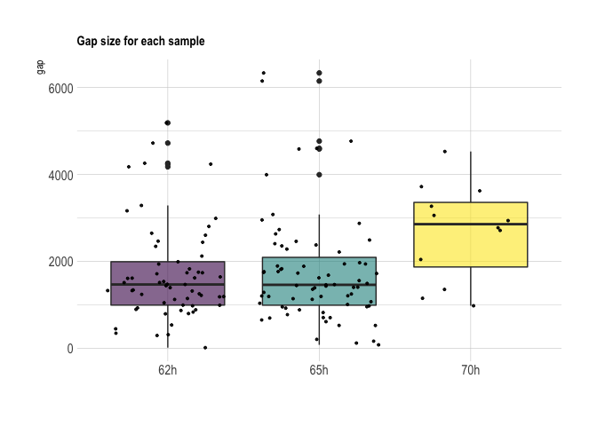

R Notebook
================

``` r
library(tidyverse)
library(hrbrthemes)
library(viridis)
library(readr)
```

``` r
################
##Load Data##
################

X62hr_fwd_edit <- read_delim("peakData/62hr.fwd.edit.bed", 
    delim = "\t", escape_double = FALSE, 
    trim_ws = TRUE)

X62hr_rev_edit <- read_delim("peakData/62hr.rev.edit.bed", 
    delim = "\t", escape_double = FALSE, 
    trim_ws = TRUE)

X65hr_fwd_edit <- read_delim("peakData/65hr.fwd.edit.bed", 
    delim = "\t", escape_double = FALSE, 
    trim_ws = TRUE)

X65hr_rev_edit <- read_delim("peakData/65hr.rev.edit.bed", 
    delim = "\t", escape_double = FALSE, 
    trim_ws = TRUE)

X70hr_fwd_edit <- read_delim("peakData/70hr.fwd.edit.bed", 
    delim = "\t", escape_double = FALSE, 
    trim_ws = TRUE)

X70hr_rev_edit <- read_delim("peakData/70hr.rev.edit.bed", 
    delim = "\t", escape_double = FALSE, 
    trim_ws = TRUE)
```

``` r
################
##Wrangle Data##
################
data <- bind_rows(X62hr_fwd_edit, X62hr_rev_edit, X65hr_fwd_edit, X65hr_rev_edit, X70hr_fwd_edit, X70hr_rev_edit) %>%
  group_by(sample, strand, cluster) %>%
  filter(summit_height == max(summit_height, na.rm=TRUE)) %>%
  ungroup() %>%
  subset(select = -c(cluster)) %>%
  mutate(strand.Val = if_else(strand == "fwd", 1, 0))

peak1 <- data %>%
  arrange(sample, desc(chr), desc(start)) %>%
  transform(gap = c(NA, ifelse(diff(strand.Val) != 0, abs(diff(start)), NA))) %>%
  filter(gap > 0) %>%
  filter(gap < 10000)
  
peak2 <- data %>%  
  arrange(sample, chr, start) %>%
  transform(gap = c(NA, ifelse(diff(strand.Val) != 0, abs(diff(start)), NA))) %>%
  filter(gap > 0) %>%
  filter(gap < 10000)

all_peaks <- bind_rows(peak1, peak2) %>%
  ungroup() %>%
  arrange(chr, start)
```

\#The Good Stuff\# This graph is a bad plot because I only plotted the
mean value of each time point. This graph gives few ideas to the reader
whereas the goal is to give the most ideas in the shortest time (Tufte
pg 51). My bad plot distorts the change in gap size because the x-axis
begins at 1750 (Tufte pg 53). I also distort the data by including only
the mean value and fitting them to an exponential curve which fits quite
nicely but does not explain the data set well.

``` r
############
##Bad Plot##
############

bad <- peak1 %>%
  group_by(sample) %>%
  summarise(mean.gap = mean(gap))%>%
  ungroup()
  
bad$time <- c(62,64,70)

ggplot(bad, aes(time, mean.gap, color='coral'))+
  geom_point()+
  geom_smooth(method="lm", aes(color="Exp Model"), formula= (y ~ exp(x)), se=FALSE, linetype = 1)
```

<!-- -->

``` r
#############
##Good Plot##
#############
ggplot(peak1, aes(sample, gap, fill=sample)) +
  geom_boxplot()+
  scale_fill_viridis(discrete = TRUE, alpha=0.6) +
  geom_jitter(color="black", size=0.7, alpha=0.9) +
  theme_ipsum() +
  theme(
    legend.position="none",
    plot.title = element_text(size=11)
  ) +
  ggtitle("Gap size for each sample") +
  xlab("")
```

<!-- -->
