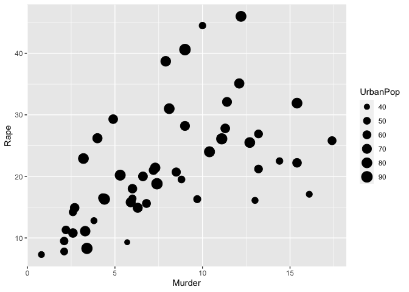

Homework3
================

I wanted to investigate the relationship between Murder, rape, and the
size of the urban population. This plot suggests that Murder and Rape
have a positive, linear relationship. It also suggests that UrbanPop
does not strongly correlate to murder rates but is more correlated to
rape.

``` r
library(tidyverse)
```

    ## ── Attaching packages ─────────────────────────────────────── tidyverse 1.3.1 ──

    ## ✓ ggplot2 3.3.5     ✓ purrr   0.3.4
    ## ✓ tibble  3.1.3     ✓ dplyr   1.0.7
    ## ✓ tidyr   1.1.3     ✓ stringr 1.4.0
    ## ✓ readr   2.0.1     ✓ forcats 0.5.1

    ## ── Conflicts ────────────────────────────────────────── tidyverse_conflicts() ──
    ## x dplyr::filter() masks stats::filter()
    ## x dplyr::lag()    masks stats::lag()

``` r
head(USArrests, 10)
```

    ##             Murder Assault UrbanPop Rape
    ## Alabama       13.2     236       58 21.2
    ## Alaska        10.0     263       48 44.5
    ## Arizona        8.1     294       80 31.0
    ## Arkansas       8.8     190       50 19.5
    ## California     9.0     276       91 40.6
    ## Colorado       7.9     204       78 38.7
    ## Connecticut    3.3     110       77 11.1
    ## Delaware       5.9     238       72 15.8
    ## Florida       15.4     335       80 31.9
    ## Georgia       17.4     211       60 25.8

``` r
ggplot(data=USArrests)+
  geom_point(mapping = aes(x = Murder, y = Rape, size = UrbanPop))
```

<!-- -->
